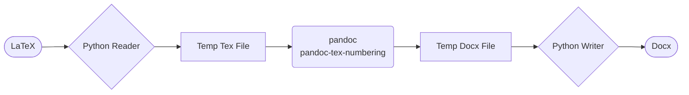

# LaTeX到docx文档转换

这是一个把LaTeX转换成docx的工作框架，框架核心是基于pandoc和pandoc-tex-numbering这个filter完成，但pandoc对LaTeX和docx的支持都不够完善，所以需要使用这个框架来完成转换前后一些额外的处理。

对于普通用户，我会提供简单的bat脚本，对于已知可以支持的功能，你只需要按照我描述的工作流程就可以零代码完成转换。对于高级用户，我会提供一些接口，你可以自定义转换的过程。

# 基本使用

如果你对于Python和LaTeX都不太熟悉，建议你直接使用以下步骤：
1. 安装pandoc
2. 安装conda
3. 使用pip安装panflute和pylatexenc
```bash
pip install panflute pylatexenc
```
1. 下载本项目
2. 把你的全部LaTeX源文件拷贝到`tex_source`目录下
3. 把要转换的`tex`文件或LaTeX项目的主文件重命名为`main.tex`
4. 运行`latex2docx.bat`
5. 转换后的docx文件会出现在与`latex2docx.bat`同级目录的下，名字是`main.docx`

# 进阶使用

你如果比较熟悉命令行，可以做一些Customized的操作，比如：

## 命令行运行

转换脚本是`latex2docx.py`，它接受三个参数：
- `--input`或`-I`：指定输入的LaTeX文件，默认是`tex_source/main.tex`
- `--output`或`-O`：指定输出的docx文件，默认是`input`同目录下，后缀改为`.docx`
- `--metadata`或`-M`：pandoc转换的metadata文件，默认是`tex_source/metadata.yaml`

因此你可以在命令行运行：

```bash
python latex2docx.py -I tex_source/main.tex -O output.docx -M tex_source/metadata.yaml
```

来完成转换

## 更新pandoc filter

`utils`目录下的`pandoc-tex-numbering.py`和`lang-num.py`是本repo创建时从[这里](https://github.com/fncokg/pandoc-tex-numbering)下载的，如果这个filter有更新，你可以直接替换这个文件。

# 高级使用

对于熟悉Python的用户，你可以把这个项目视为一个工作脚手架。本项目的工作流如下：



简单来说，本框架先读取原始LaTeX文件，允许你对LaTeX文件做任何转换时修改，之后调用pandoc转换，转换之后允许你对docx做任何修改，最后输出docx文件。期间产生的任何临时文件都会被删除，从而不对原始文件造成任何影响。

## 自定义reader和writer

修改`processor.py`文件，你可以自定义`reader`和`writer`函数，来实现自己的转换需求。

**注意：当前的`reader`和`writer`函数是一个针对`hithesis`的示例。**

`reader(input_file:str)->str`函数接受一个LaTeX文件的路径，你需要自己读取这个文件，做任何你想做的修改，然后返回一个字符串，这个字符串是修改后的LaTeX文件的内容。推荐基于`re`和`pylatexenc`来完成。

`writer(tmp_docxfile:str, output_file:str)->None`函数接受一个临时docx文件的路径和一个输出docx文件的路径，你需要自己读取这个临时docx文件，做任何你想做的修改，然后保存到输出docx文件。推荐基于`python-docx`来完成。

## 自定义pandoc参数

修改`latex2docx.py`文件最顶部的两个常量`PANDOC_ARGS`和`PANDOC_FILTERS`，你可以自定义pandoc的参数和filter。